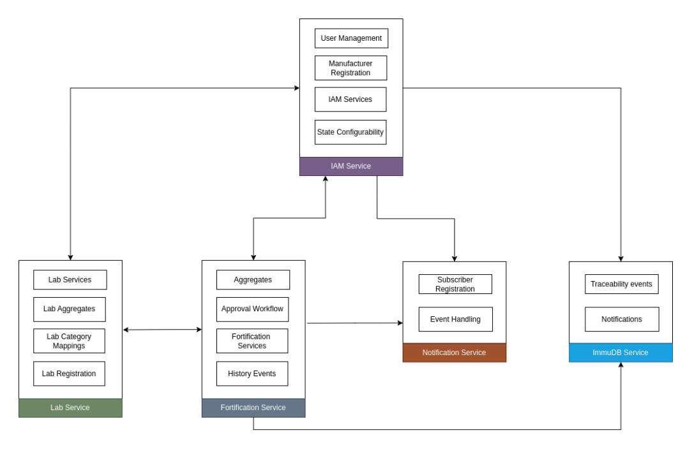

# Implementation Guide

## **Setup Instructions** 

### **Pre-Requisites**

* Java version  17
* Mysql db version 8
* Keycloak
* ImmuDB
* Kafka

### **Services**

1. **Fortification service**
   * **Aggregates**:
     * Responsible for calculating aggregates of batches and lots daily for a manufacturer/unit.
     * An event will be triggered for every action by a user and the quantity for the respective stage will be sent to Kafka and consumed by the service and added to the aggregates.
   * **Approval workflow**:
     * Access to the stages defined in DSL are controlled through Role Based Access Control (RABC).
     * Users with the required role for a stage can approve the flow and move to the next stage.
   * **History Events:**
     * For any status change happening in the application due to user performing an action, an event will be triggered for the history of the stage and sent to Kafka.
   * **Fortification Services**:
     1. **Raw Materials Mapped to Given Stage and Inventory**
        * Tracking and recording the assignment of raw materials to specific stages in the fortification process.
        * Maintaining an up-to-date inventory of all raw materials.
     2. **Creation and Dispatching the Lots for Raw Materials**
        * Generating and managing lots of raw materials.
        * Ensuring proper dispatching protocols are followed for each lot.
     3. **Creation of Vendors for Fetching Raw Materials from External Sources**
        * Identifying and creating profiles for vendors.
        * Ensuring sourcing of raw materials from external vendors is properly documented.
     4. **Creation of Batch Using Raw Materials**
        * Formulating batches utilising the raw materials.
        * Maintaining records for each batch created.
     5. **Dispatching the Batch to Next Stage or Lab**
        * Organising and managing the dispatch of batches to subsequent stages or laboratories for testing.
        * Ensuring each dispatch is logged and tracked.
     6. **Maintaining Flow of Materials Through the Process Flow**
        * Monitoring and documenting the progression of materials through each stage of the fortification process.
        * Ensuring smooth and continuous flow of materials from start to finish.
2. **Lab Service**
   1. **Lab Services**:
      * **List of Batches Sent for Lab Testing**
        * Keeping a record of all batches dispatched for laboratory testing.
      * **Receiving a Product for Testing in Any Stage**
        * Accepting and logging products received for testing at various stages.
      * **Submitting Test Results or Rejecting**
        * Documenting and submitting test results.
        * Recording and processing any rejections based on test outcomes.
   2. **Lab Aggregates:**
      * Count and quantity aggregates for lab samples will be calculated daily for Labs and accumulated through the aggregate tables.
   3. **Lab Registrations:**
      * Responsible for Onboarding of labs by capturing necessary information along with geo details.
   4. **Lab Category Mappings:**
      * Category Mappings of labs are captured in this service, which will be used for testing the batch and lot samples assigned to specific category.
3. **IAM Service**
   1. **User Management:**
      * Responsible for maintaining user information which includes creating user, updating user, resetting user password etc.
      * User role management through Keycloak is maintained in this service.
   2. **Manufacturer Registration**:
      * Responsible for Onboarding and updating of Manufacturers by capturing necessary information along with geo details.
      * Onboarding multiple new manufacturers and updating existing manufacturers through bulk excel upload is done through this service
   3. **Manufacturer Category Mappings:**
      * Category Mappings of manufacturers/units are captured in this service, which will be used for determining roles and stages for manufacturers/units.
   4. **IAM Services:**
      * Responsible for login and accessing APIs.
      * Generates manufacturer and user lists for agency count aggregates in monitor module.
   5. **State Configuration:**
      * State level configuration for different features.
      * Can edit feature requirements state wise.
4. **Broadcast Service**
   1. **Event Handling**
      * This service contains workflow to connect external service for data exchange between platforms
      * For any approval in the system the subscribers registered to the state of the manufacturer/unit in which the event occurred will receive data related to the said event in encrypted format
   2. **Subscriber Registration:**
      * Responsible for onboarding stakeholders as subscribers to receive callbacks for any events happening in the registered state.
      * Admin onboards subscribers to the system by procuring basic details of the subscriber along with a callback URL for publishing encrypted data.
5. **Immudb Service**
   1. **Traceability events:**
      * Stores history of batches and lots. Has methods for accessing history for batch history trees.
      * Responsible for maintaining traceability of the entire application.
   2. **Notifications:**
      * Responsible for tracking notifications for users on every action performed.

### **Installation**:

* Clone the above services and build with maven
* Run the services on appropriate instances
* {BASE\_URL}/ v3/api-docs hit the given API to get the API’s list on the service
