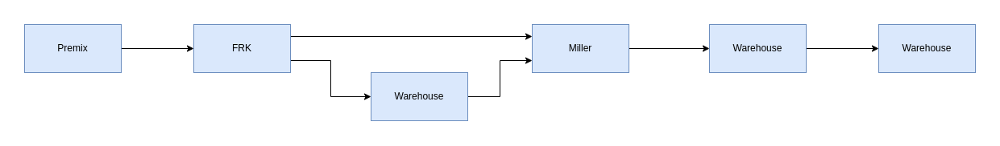
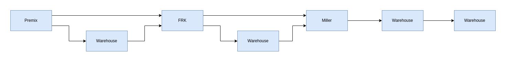
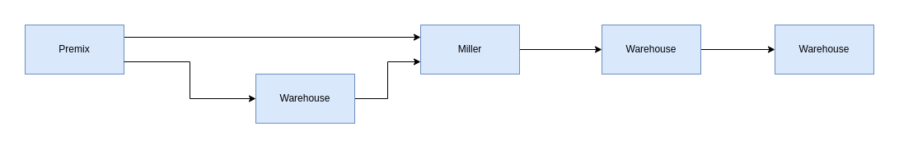

# Functionality

As we are developing rice fortification systems, we have identified the need for a similar QA/QC approach for other commodities across different countries.

With respect to the Food Fortification Quality Management System (FFQMS), while it is currently used for rice as a product, we have created a customizable and configurable system that can be applied to various commodities like milk, salt, and sugar. This adaptable system supports the fortification process across multiple food items.

The FFQMS requires a predefined Domain-Specific Language (DSL) for initial configuration, which sets up the default parameters.


## **DSL:**

1. The platform aims to track a product through various stages of processing and testing until it becomes a fortified product.
2. Each stage can include:
   1. A set of required input materials
   2. Target categories to which the processed product must be delivered
3. Batches for a category can be created from raw material lots and dispatched to the next category manufacturer or unit.
4. Lots can be created from approved batches.
5. Both lot and batch samples can be sent to the lab for testing.

Considering the above, the platform can be configured to manage the following:

* **Stages:** Define the stages a product goes through from raw materials to a fortified product.
* **Raw Materials and Target Categories:** Specify the raw materials required and the target categories for each stage.
* **Lab Testing:** Include options for lab testing during the dispatch and receipt of products

### Sample DSL contains following fields for configuration

* “product” -> name of the product
* “platform\_name” -> display name of platform
* “description” -> description of platform
* “categories” -> list of categories present
  * “name” -> name of category
  * “outside\_platform” -> Boolean whether it is captured outside the platform or not
* “stages” -> list of stages present
* “workflow” -> details of workflow in each category stage
  * “name” -> name of stage
  * “categories” -> list of categories and their workflow
    * “name” -> category name
    * "type" -> it can be either creation/dispatch based upon the stage whether used for batch creation or storing lots.
    * “raw\_materials” -> categories which can be used as raw materials for this stage
    * "target" -> list of categories to which lots can be sent to
      * “name” -> category name of target
      * "receive\_lab\_option" -> whether the lot needs to sent to lab testing before receiving, it can be "OPTIONAL" or “MANDATE” or “NA”
      * "dispatch\_lab\_option": whether the batch needs to sent to lab testing before receiving, it can be "OPTIONAL" or “MANDATE” or “NA”

### **Sample DSL Json Schema:**

<pre class="language-json" data-overflow="wrap"><code class="lang-json">{
<strong>  "$schema": "http://json-schema.org/draft-04/schema#",
</strong>  "type": "object",
  "properties": {
    "product": {
      "type": "string"
    },
    "platform_name": {
      "type": "string"
    },
    "description": {
      "type": "string"
    },
    "categories": {
      "type": "array",
      "items": [
        {
          "type": "object",
          "properties": {
            "name": {
              "type": "string"
            },
            "outside_platform": {
              "type": "boolean"
            }
          },
          "required": [
            "name",
            "outside_platform"
          ]
        },
        {
          "type": "object",
          "properties": {
            "name": {
              "type": "string"
            },
            "outside_platform": {
              "type": "boolean"
            }
          },
          "required": [
            "name",
            "outside_platform"
          ]
        },
        {
          "type": "object",
          "properties": {
            "name": {
              "type": "string"
            },
            "outside_platform": {
              "type": "boolean"
            }
          },
          "required": [
            "name",
            "outside_platform"
          ]
        },
        {
          "type": "object",
          "properties": {
            "name": {
              "type": "string"
            },
            "outside_platform": {
              "type": "boolean"
            }
          },
          "required": [
            "name",
            "outside_platform"
          ]
        },
        {
          "type": "object",
          "properties": {
            "name": {
              "type": "string"
            },
            "outside_platform": {
              "type": "boolean"
            }
          },
          "required": [
            "name",
            "outside_platform"
          ]
        },
        {
          "type": "object",
          "properties": {
            "name": {
              "type": "string"
            },
            "outside_platform": {
              "type": "boolean"
            }
          },
          "required": [
            "name",
            "outside_platform"
          ]
        }
      ]
    },
    "stages": {
      "type": "array",
      "items": [
        {
          "type": "string"
        },
        {
          "type": "string"
        },
        {
          "type": "string"
        },
        {
          "type": "string"
        }
      ]
    },
    "workflow": {
      "type": "array",
      "items": [
        {
          "type": "object",
          "properties": {
            "name": {
              "type": "string"
            },
            "categories": {
              "type": "array",
              "items": [
                {
                  "type": "object",
                  "properties": {
                    "name": {
                      "type": "string"
                    },
                    "type": {
                      "type": "string"
                    },
                    "raw_materials": {
                      "type": "array",
                      "items": [
                        {
                          "type": "string"
                        }
                      ]
                    },
                    "target": {
                      "type": "array",
                      "items": [
                        {
                          "type": "object",
                          "properties": {
                            "name": {
                              "type": "string"
                            },
                            "receive_lab_option": {
                              "type": "string"
                            }
                          },
                          "required": [
                            "name",
                            "receive_lab_option"
                          ]
                        }
                      ]
                    },
                    "dispatch_lab_option": {
                      "type": "string"
                    }
                  },
                  "required": [
                    "name",
                    "type",
                    "raw_materials",
                    "target",
                    "dispatch_lab_option"
                  ]
                }
              ]
            }
          },
          "required": [
            "name",
            "categories"
          ]
        },
        {
          "type": "object",
          "properties": {
            "name": {
              "type": "string"
            },
            "categories": {
              "type": "array",
              "items": [
                {
                  "type": "object",
                  "properties": {
                    "name": {
                      "type": "string"
                    },
                    "type": {
                      "type": "string"
                    },
                    "raw_materials": {
                      "type": "array",
                      "items": [
                        {
                          "type": "string"
                        },
                        {
                          "type": "string"
                        }
                      ]
                    },
                    "target": {
                      "type": "array",
                      "items": [
                        {
                          "type": "object",
                          "properties": {
                            "name": {
                              "type": "string"
                            },
                            "receive_lab_option": {
                              "type": "string"
                            }
                          },
                          "required": [
                            "name",
                            "receive_lab_option"
                          ]
                        },
                        {
                          "type": "object",
                          "properties": {
                            "name": {
                              "type": "string"
                            },
                            "receive_lab_option": {
                              "type": "string"
                            }
                          },
                          "required": [
                            "name",
                            "receive_lab_option"
                          ]
                        }
                      ]
                    },
                    "dispatch_lab_option": {
                      "type": "string"
                    }
                  },
                  "required": [
                    "name",
                    "type",
                    "raw_materials",
                    "target",
                    "dispatch_lab_option"
                  ]
                }
              ]
            }
          },
          "required": [
            "name",
            "categories"
          ]
        },
        {
          "type": "object",
          "properties": {
            "name": {
              "type": "string"
            },
            "categories": {
              "type": "array",
              "items": [
                {
                  "type": "object",
                  "properties": {
                    "name": {
                      "type": "string"
                    },
                    "type": {
                      "type": "string"
                    },
                    "raw_materials": {
                      "type": "array",
                      "items": [
                        {
                          "type": "string"
                        },
                        {
                          "type": "string"
                        }
                      ]
                    },
                    "target": {
                      "type": "array",
                      "items": [
                        {
                          "type": "object",
                          "properties": {
                            "name": {
                              "type": "string"
                            },
                            "receive_lab_option": {
                              "type": "string"
                            }
                          },
                          "required": [
                            "name",
                            "receive_lab_option"
                          ]
                        }
                      ]
                    },
                    "dispatch_lab_option": {
                      "type": "string"
                    }
                  },
                  "required": [
                    "name",
                    "type",
                    "raw_materials",
                    "target",
                    "dispatch_lab_option"
                  ]
                }
              ]
            }
          },
          "required": [
            "name",
            "categories"
          ]
        },
        {
          "type": "object",
          "properties": {
            "name": {
              "type": "string"
            },
            "categories": {
              "type": "array",
              "items": [
                {
                  "type": "object",
                  "properties": {
                    "name": {
                      "type": "string"
                    },
                    "type": {
                      "type": "string"
                    },
                    "raw_materials": {
                      "type": "array",
                      "items": {
                      }
                    },
                    "target": {
                      "type": "array",
                      "items": [
                        {
                          "type": "object",
                          "properties": {
                            "name": {
                              "type": "string"
                            },
                            "receive_lab_option": {
                              "type": "string"
                            }
                          },
                          "required": [
                            "name",
                            "receive_lab_option"
                          ]
                        }
                      ]
                    },
                    "dispatch_lab_option": {
                      "type": "string"
                    }
                  },
                  "required": [
                    "name",
                    "type",
                    "raw_materials",
                    "target",
                    "dispatch_lab_option"
                  ]
                },
                {
                  "type": "object",
                  "properties": {
                    "name": {
                      "type": "string"
                    },
                    "type": {
                      "type": "string"
                    },
                    "raw_materials": {
                      "type": "array",
                      "items": {
                      }
                    },
                    "target": {
                      "type": "array",
                      "items": [
                        {
                          "type": "object",
                          "properties": {
                            "name": {
                              "type": "string"
                            },
                            "receive_lab_option": {
                              "type": "string"
                            }
                          },
                          "required": [
                            "name",
                            "receive_lab_option"
                          ]
                        },
                        {
                          "type": "object",
                          "properties": {
                            "name": {
                              "type": "string"
                            },
                            "receive_lab_option": {
                              "type": "string"
                            }
                          },
                          "required": [
                            "name",
                            "receive_lab_option"
                          ]
                        }
                      ]
                    },
                    "dispatch_lab_option": {
                      "type": "string"
                    }
                  },
                  "required": [
                    "name",
                    "type",
                    "raw_materials",
                    "target",
                    "dispatch_lab_option"
                  ]
                }
              ]
            }
          },
          "required": [
            "name",
            "categories"
          ]
        }
      ]
    }
  },
  "required": [
    "product",
    "platform_name",
    "description",
    "categories",
    "stages",
    "workflow"
  ]
}
</code></pre>

### **Sample DSLs with use cases:**

#### **Use case example DSL for Rice Fortification implementation:**

```json
{
  "product": "rice",
  "platform_name": "Rice Fortification",
  "description": "This is rice fortification",
  "categories": [
    {
      "name": "Raw Material",
      "outside_platform": true
    },
    {
      "name": "Premix",
      "outside_platform": false
    },
    {
      "name": "Rice Mix",
      "outside_platform": true
    },
    {
      "name": "FRK",
      "outside_platform": false
    },
    {
      "name": "Rice",
      "outside_platform": true
    },
    {
      "name": "Miller",
      "outside_platform": false
    }
  ],
  "stages": [
    "Premix Manufacturer",
    "FRK Manufacturer",
    "Miller",
    "Warehouse"
  ],
  "workflow": [
    {
      "name": "Premix Manufacturer",
      "categories": [
        {
          "name": "Premix",
          "type": "creation",
          "raw_materials": [
            "Raw Material"
          ],
          "target": [
            {
              "name": "FRK",
              "receive_lab_option": "OPTIONAL"
            }
          ],
          "dispatch_lab_option": "MANDATE"
        }
      ]
    },
    {
      "name": "FRK Manufacturer",
      "categories": [
        {
          "name": "FRK",
          "type": "creation",
          "raw_materials": [
            "Rice Mix",
            "Premix"
          ],
          "target": [
            {
              "name": "Miller",
              "receive_lab_option": "OPTIONAL"
            },
            {
              "name": "Warehouse",
              "receive_lab_option": "OPTIONAL"
            }
          ],
          "dispatch_lab_option": "MANDATE"
        }
      ]
    },
    {
      "name": "Miller",
      "categories": [
        {
          "name": "Miller",
          "type": "creation",
          "raw_materials": [
            "Rice",
            "FRK"
          ],
          "target": [
            {
              "name": "Warehouse",
              "receive_lab_option": "OPTIONAL"
            }
          ],
          "dispatch_lab_option": "OPTIONAL"
        }
      ]
    },
    {
      "name": "Warehouse",
      "categories": [
        {
          "name": "Miller",
          "type": "dispatch",
          "raw_materials": [
          ],
          "target": [
            {
              "name": "Warehouse",
              "receive_lab_option": "OPTIONAL"
            }
          ],
          "dispatch_lab_option": "NA"
        },
        {
          "name": "FRK",
          "type": "dispatch",
          "raw_materials": [
          ],
          "target": [
            {
              "name": "Miller",
              "receive_lab_option": "OPTIONAL"
            },
            {
              "name": "Warehouse",
              "receive_lab_option": "OPTIONAL"
            }
          ],
          "dispatch_lab_option": "NA"
        }
      ]
    }
  ]
}
```

**Workflow**:&#x20;

**Initial Stage: Premix Manufacturer**

* **Raw Material Lots:** A Premix Manufacturer creates raw material lots sourced from vendors.
* **Premix Batch Creation:** These raw material lots are combined to create a premix batch.
* **Lab Testing:** After creating the premix batch, a sample must be sent to the lab for testing, as specified in the DSL. The lab tests the sample based on various factors and the quantities of raw materials in the premix batch. The batch is either approved or rejected based on whether the test results fall within the required range.
* **Dispatch:** Once the premix batch is tested and approved, it can be dispatched to the manufacturers of the next stage.
* **Lot Dispatch:** Premix manufacturers can dispatch their approved batches as lots only to Fortified Rice Kernel (FRK) manufacturers.
* Here’s a refined version of your description for the second stage at the FRK Manufacturers:

**Second Stage: FRK Manufacturers**

* **Receiving Premix Lot:** The dispatched premix lot is received at the FRK manufacturer and can be either directly approved or sent to the lab for testing.
* **Creating FRK Batch:** Once the lot is approved, it can be used to create an FRK batch. This batch is made by mixing rice mix with the approved premix lot in the required proportions. Rice mix lots are created by the FRK manufacturer, similar to how raw material lots are created for the premix.
* **Lab Testing:** After creating the FRK batch, a sample is tested following the same procedure used for the premix sample test.
* **Dispatch:** Once the FRK batch passes the lab test and is approved, it can be dispatched as lots to the next stage.
* **Target Stages:** The FRK batch can be dispatched to one of two possible target stages:
  * **Miller**
  * **Warehouse**

**When the FRK is Dispatched to Miller:**

* **Receiving the FRK Lot:** A miller can either accept the lot directly or send it to the lab for testing.
* **Creating Miller Batch:** If the FRK lot is accepted, the miller can use a calculated mixture of the FRK lot and rice to create a Miller batch. The rice is created by the miller in a manner similar to the creation of raw material lots for the premix.
* **Dispatching Miller Batch:** The miller can dispatch the Miller batch as lots to the next stage, even without testing.
* **Target Stage for Miller Lots:** Miller lots can only be sent to warehouses.
* **Miller Lots at Warehouse:**
* **Receiving Miller Lots:** A warehouse receives Miller lots, with an optional lab test of the lot sample.
* **Storing and Dispatching:** If the Miller lots are accepted at the warehouse, they are stored and can only be dispatched to other warehouses.

**When FRK Dispatches Lots to Warehouse:**

* **Receiving the FRK Lot:** Upon receipt of the FRK lot at the warehouse, it can be either accepted directly or sent to the lab for testing.
* **Storing and Dispatching:** After the FRK lot is accepted, it is stored at the warehouse. The accepted lot can then be:
  * Dispatched to a miller manufacturer for Miller batch creation, or
  * Dispatched to another warehouse.

**Data Flow Diagram:**



#### **Use case example DSL for premix to warehouse:**

```json
{
  "product": "rice",
  "platform_name": "Rice Fortification",
  "description": "This is rice fortification",
  "categories": [
    {
      "name": "Raw Material",
      "outside_platform": true
    },
    {
      "name": "Premix",
      "outside_platform": false
    },
    {
      "name": "Rice Mix",
      "outside_platform": true
    },
    {
      "name": "FRK",
      "outside_platform": false
    },
    {
      "name": "Rice",
      "outside_platform": true
    },
    {
      "name": "Miller",
      "outside_platform": false
    }
  ],
  "stages": [
    "Premix Manufacturer",
    "FRK Manufacturer",
    "Miller",
    "Warehouse"
  ],
  "workflow": [
    {
      "name": "Premix Manufacturer",
      "categories": [
        {
          "name": "Premix",
          "type": "creation",
          "raw_materials": [
            "Raw Material"
          ],
          "target": [
            {
              "name": "FRK",
              "receive_lab_option": "OPTIONAL"
            },
            {
              "name": "Warehouse",
              "receive_lab_option": "OPTIONAL"
            }
          ],
          "dispatch_lab_option": "MANDATE"
        }
      ]
    },
    {
      "name": "FRK Manufacturer",
      "categories": [
        {
          "name": "FRK",
          "type": "creation",
          "raw_materials": [
            "Rice Mix",
            "Premix"
          ],
          "target": [
            {
              "name": "Miller",
              "receive_lab_option": "OPTIONAL"
            },
            {
              "name": "Warehouse",
              "receive_lab_option": "OPTIONAL"
            }
          ],
          "dispatch_lab_option": "MANDATE"
        }
      ]
    },
    {
      "name": "Miller",
      "categories": [
        {
          "name": "Miller",
          "type": "creation",
          "raw_materials": [
            "Rice",
            "FRK"
          ],
          "target": [
            {
              "name": "Warehouse",
              "receive_lab_option": "OPTIONAL"
            }
          ],
          "dispatch_lab_option": "OPTIONAL"
        }
      ]
    },
    {
      "name": "Warehouse",
      "categories": [
        {
          "name": "Miller",
          "type": "dispatch",
          "raw_materials": [
          ],
          "target": [
            {
              "name": "Warehouse",
              "receive_lab_option": "OPTIONAL"
            }
          ],
          "dispatch_lab_option": "NA"
        },
        {
          "name": "FRK",
          "type": "dispatch",
          "raw_materials": [
          ],
          "target": [
            {
              "name": "Miller",
              "receive_lab_option": "OPTIONAL"
            },
            {
              "name": "Warehouse",
              "receive_lab_option": "OPTIONAL"
            }
          ],
          "dispatch_lab_option": "NA"
        },
        {
          "name": "Premix",
          "type": "dispatch",
          "raw_materials": [
          ],
          "target": [
            {
              "name": "FRK",
              "receive_lab_option": "OPTIONAL"
            },
            {
              "name": "Warehouse",
              "receive_lab_option": "OPTIONAL"
            }
          ],
          "dispatch_lab_option": "NA"
        }
      ]
    }
  ]
}
```

**Workflow:**&#x20;

**Initial Stage: Premix Manufacturer**

1. **Raw Material Lots:** A Premix Manufacturer creates raw material lots from vendors.
2. **Premix Batch Creation:** These raw material lots are combined to create a premix batch.
3. **Lab Testing:** After the premix batch is created, a sample must be sent to the lab for testing as specified in the DSL. The test evaluates multiple factors/material quantities of the raw materials in the premix batch. The batch is approved or rejected based on whether the test results fall within the required range.
4. **Dispatch:** Once approved, the batch can be dispatched to the next stage. Premix manufacturers can dispatch their batches as lots to either FRK manufacturers or warehouses.

**When Premix is Dispatched to Warehouse**

1. **Receiving the Premix Lot:** Upon receipt at the warehouse, the premix lot can be accepted directly or sent to the lab for testing.
2. **Storing and Dispatching:** After acceptance, the premix lot is stored at the warehouse. It can then be dispatched to a FRK manufacturer for FRK batch creation or to another warehouse.

**At FRK Manufacturers**

1. **Receiving the Premix Lot:** The premix lot (received directly from the Premix Manufacturer or via a Warehouse) can be accepted directly or sent to the lab for testing.
2. **Creating FRK Batch:** Once the lot is approved, it is used to create an FRK batch by mixing with rice mix in required proportions. Rice mix lots are created by the FRK manufacturer in a manner similar to creating raw material lots for the premix.
3. **Lab Testing:** A sample from the FRK batch is tested following the same procedure used for premix testing.
4. **Dispatch:** After approval, the FRK batch can be dispatched as lots to the next stage. FRK can be dispatched to either:
   1. **Miller**
   2. **Warehouse**

**When FRK is Dispatched to Miller**

1. **Receiving the FRK Lot:** A miller can accept the FRK lot directly or send it to the lab for testing.
2. **Creating Miller Batch:** If accepted, the miller can use a calculated mixture of FRK lot and rice to create a Miller batch. Rice is created by the miller in a manner similar to the creation of raw material lots for the premix.
3. **Dispatching Miller Batch:** The Miller batch can be dispatched as lots to the next stage, even without additional testing.
4. **Target Stage for Miller Lots:** Miller lots can only be sent to warehouses.

**Miller Lots at Warehouse**

1. **Receiving Miller Lots:** A warehouse receives Miller lots, with an optional lab test of the lot sample.
2. **Storing and Dispatching:** If accepted, the Miller lots are stored and can only be dispatched to other warehouses.

**When FRK Dispatches Lots to Warehouse**

1. **Receiving the FRK Lot:** Upon receipt at the warehouse, the FRK lot can be accepted directly or sent to the lab for testing.
2. **Storing and Dispatching:** After acceptance, the FRK lot is stored and can be dispatched to a miller manufacturer for Miller batch creation or to another warehouse.

**Data Flow Diagram:**



#### **Use case example DSL for flow without FRK:**

```json
{
  "product": "rice",
  "platform_name": "Rice Fortification",
  "description": "This is rice fortification",
  "categories": [
    {
      "name": "Raw Material",
      "outside_platform": true
    },
    {
      "name": "Premix",
      "outside_platform": false
    },
    {
      "name": "Rice Mix",
      "outside_platform": true
    },
    {
      "name": "Rice",
      "outside_platform": true
    },
    {
      "name": "Miller",
      "outside_platform": false
    }
  ],
  "stages": [
    "Premix Manufacturer",
    "Miller",
    "Warehouse"
  ],
  "workflow": [
    {
      "name": "Premix Manufacturer",
      "categories": [
        {
          "name": "Premix",
          "type": "creation",
          "raw_materials": [
            "Raw Material"
          ],
          "target": [
            {
              "name": "Miller",
              "receive_lab_option": "OPTIONAL"
            },
            {
              "name": "Warehouse",
              "receive_lab_option": "OPTIONAL"
            }
          ],
          "dispatch_lab_option": "MANDATE"
        }
      ]
    },
    {
      "name": "Miller",
      "categories": [
        {
          "name": "Miller",
          "type": "creation",
          "raw_materials": [
            "Rice",
            "Premix"
          ],
          "target": [
            {
              "name": "Warehouse",
              "receive_lab_option": "OPTIONAL"
            }
          ],
          "dispatch_lab_option": "OPTIONAL"
        }
      ]
    },
    {
      "name": "Warehouse",
      "categories": [
        {
          "name": "Miller",
          "type": "dispatch",
          "raw_materials": [
          ],
          "target": [
            {
              "name": "Warehouse",
              "receive_lab_option": "OPTIONAL"
            }
          ],
          "dispatch_lab_option": "NA"
        },
        {
          "name": "Premix",
          "type": "dispatch",
          "raw_materials": [
          ],
          "target": [
            {
              "name": "Miller",
              "receive_lab_option": "OPTIONAL"
            },
            {
              "name": "Warehouse",
              "receive_lab_option": "OPTIONAL"
            }
          ],
          "dispatch_lab_option": "NA"
        }
      ]
    }
  ]
}
```

**Workflow:**&#x20;

**Initial Stage: Premix Manufacturer**

* **Raw Material Lots:** A Premix Manufacturer creates raw material lots from vendors.
* **Premix Batch Creation:** These raw material lots are combined to create a premix batch.
* **Lab Testing:** After the premix batch is created, a sample must be sent to the lab for testing as specified in the DSL. The test evaluates multiple factors and the quantities of raw materials in the premix batch. The batch is either approved or rejected based on whether the test results fall within the required range.
* **Dispatch:** Once the batch is tested and approved, it can be dispatched to the next stage. Premix can be dispatched to either:
  * **Miller**
  * **Warehouse**

**When Premix is Dispatched to Warehouse**

* **Receiving the Premix Lot:** At the warehouse, the premix lot can be accepted directly or sent to the lab for testing.
* **Storing and Dispatching:** After acceptance, the premix lot is stored and can be dispatched to:
  * **Miller** for Miller batch creation, or
  * **Another Warehouse**

**At Miller**

* **Receiving Premix Lot:** The miller can accept the premix lot (received directly from the Premix Manufacturer or via a Warehouse) or send it to the lab for testing.
* **Creating Miller Batch:** If accepted, the miller uses a calculated mixture of the premix lot and rice to create a Miller batch. The rice is created by the miller similarly to the creation of raw material lots for the premix.
* **Dispatching Miller Batch:** The Miller batch can be dispatched as lots to the next stage, even without additional testing.
* **Target Stage for Miller Lots:** Miller lots can only be sent to warehouses.

**Miller Lots at Warehouse**

* **Receiving Miller Lots:** A warehouse receives Miller lots, with an optional lab test of the lot sample.
* **Storing and Dispatching:** If accepted, the Miller lots are stored and can only be dispatched to other warehouses

**Data Flow Diagram:**



#### &#x20;<a href="#toc1471729294" id="toc1471729294"></a>
