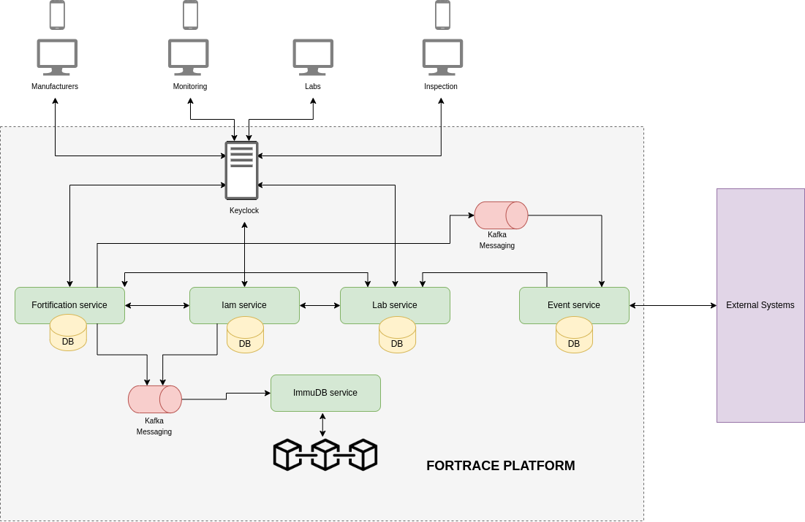

# Technology Stack

#### &#x20;

Above is a diagram showcasing the technology stack used to build the workflow software. Each tool contributed uniquely to the creation of the software.

* **Backend**: Utilizing Java for microservices presents various benefits compared to other technologies. Java boasts a strong ecosystem with abundant libraries, frameworks, and tools tailored for microservice development. Frameworks such as Spring Boot, drop wizard, and Micronaut offer comprehensive support, including dependency injection, RESTful APIs, and service discovery. Combined with technologies like Kubernetes and Docker, Java ensures scalability for growing workloads. Additionally, Java’s attributes such as high performance, compatibility, strong community support, integration capabilities, enterprise adoption, and security make it a compelling choice.
* **Authentication Network**: Key Cloak provides a robust, secure, and customizable authentication solution for managing user identities and ensuring secure application access. With out-of-the-box support for OpenID Connect, OAuth 2.0, and SAML 2.0, it offers comprehensive security features. Its intuitive admin console simplifies user, role, and permission management. Key Cloak’s extensive features, scalability, and seamless integration make it a preferred choice for application adoption.
* **Frontend**: React.js, a frontend JavaScript library, offers significant advantages over other technologies for UI development. Its component-based architecture promotes code reusability, maintainability, and scalability. Utilizing Virtual DOM enhances rendering performance, while JSX syntax simplifies component creation and readability. With features like unidirectional data flow, a rich ecosystem, cross-platform capabilities, performance optimization, and strong community support, React.js enables the creation of modern and dynamic user interfaces efficiently.
* **Database**: MySQL and ImdmuDB serve distinct data storage needs, each with unique advantages. MySQL, as a mature and reliable relational database management system (RDBMS), offers scalability, a rich feature set, and robust security features. In contrast, ImmuDB provides tamper-evident data storage by design, ensuring immutability and cryptographic proof for every transaction, making data alteration or deletion detectable. ImmuDB is preferred for applications prioritizing data immutability, auditability, and integrity.
* **Event-Driven Architecture (Kafka):** Implementing Kafka for event listening.
