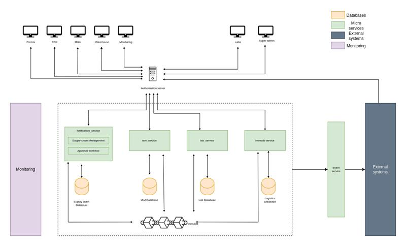

# An Overview of our Technologies and Framework

<figure><figcaption></figcaption></figure>

Food Fortification is based on the following technologies:

* Spring Boot, including the Java programming language
* Keycloak for authentication and authorization
* Immudb for traceability
* MySql Database
* Kafka for event streaming

In addition, we use Docker to deploy and run the application.

If you are not familiar with (some of) our tools and technologies yet, here are some useful resources to get started. You will need to have basic knowledge of these before you can properly start contributing to our project.

**Git (and GitHub)**

Git helps us track all changes to our project, allows us to revert things and is the basis for our code review process.

Haven't worked with git source control yet? Work through a basic tutorial like this [Intro to Git and GitHub for Beginners (Tutorial)](https://product.hubspot.com/blog/git-and-github-tutorial-for-beginners).

You can also check out the [official git book](https://git-scm.com/book/de/v2) (chapter 1-3 are most relevant).

**Java**

Java is our core programming languages. If you're familiar with object-oriented languages, learning Java should be straightforward. It’s widely used for building enterprise applications due to its stability and scalability. If you have experience with languages like C++ or C#, Java will feel familiar as it shares many similar syntax and design principles.

(If you're new to Java, plenty of free tutorials and online courses are available to help you get started. We recommend building a strong foundation before diving into our project.)

If you have worked with other general-purpose, high-level languages, you’ll find Java easy to pick up. Here’s a basic resource to help: [Java Programming Basics](https://www.javatpoint.com/java-tutorial)

**Spring Boot**

Spring Boot is a highly popular framework that simplifies building Java applications, particularly those with complex backend architectures. It abstracts away much of the boilerplate code and offers out-of-the-box tools for building web applications and microservices.

It’s crucial to get a handle on Spring Boot’s concepts like dependency injection, controllers, and RESTful services, as they are key to our project’s structure. Spend some time on the basics now, and you'll find developing within the project much easier later.

Here's a good place to start: [Spring Boot - Getting Started](https://spring.io/guides/gs/spring-boot/)

You’ll need a working knowledge of Spring Boot’s fundamental concepts such as beans, services, and repositories. As you gain experience, you’ll be able to tackle more advanced features, and we’ll be happy to guide you through those.

**MySQL**

MySQL is a widely used open-source relational database management system (RDBMS) that we rely on for structured data storage and management. If you’ve worked with databases before, especially SQL-based ones, MySQL will feel very familiar. It supports SQL queries, which means you’ll be using SQL commands to interact with the data.

If you are new to MySQL or databases in general, it’s important to understand core concepts like tables, indexes, primary keys, foreign keys, and relationships between tables. Knowing how to write basic SQL queries for inserting, updating, deleting, and retrieving data will be essential for working on our project.

To get started, check out: [MySQL - Getting Started](https://dev.mysql.com/doc/refman/8.0/en/tutorial.html)

**immudb**

Our project utilizes **immudb**, a secure, high-performance immutable database. The key feature of immudb is that it provides tamper-evident data storage, ensuring data integrity and immutability. While you don’t need to be an expert in immudb for most parts of the project, it’s helpful to understand its core concepts.

If you're interested in learning more, start here: [immudb - Documentation](https://docs.immudb.io/master/)

**Keycloak**

Keycloak is an open-source Identity and Access Management (IAM) solution that we use to manage user authentication and authorization. It handles user login, token management, and role-based access control, which makes it a central part of our security architecture.

You don’t need to know every detail of Keycloak to start working on our project, but it's important to have a basic understanding of how it handles authentication flows and integrates with Spring Boot.

You can begin learning here: [Keycloak - Getting Started](https://www.keycloak.org/guides#getting-started)

**Kafka**

Kafka is a distributed event streaming platform that we use for building real-time data pipelines and streaming applications. It allows for efficient handling of large-scale, real-time data streams. Kafka plays a key role in ensuring seamless communication between different services in our system.

While Kafka’s advanced features are something you can dive into later, getting a grip on the basics now—like producers, consumers, and topics—will make working with it smoother down the road.

Here’s a great starting point: [Kafka - Introduction](https://kafka.apache.org/documentation/#gettingStarted)
